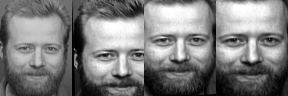

# Eigenface

3210104591 秦雨扬

## 人眼标注

对于采集的图像，我们将它放在同一个文件夹下，使用 mark_eye 进行人眼标注，采用 mouse 回调函数进行处理

这里以s41文件夹作为演示

## 模版匹配

$$
\left[\begin{array}{c}
x* \\
y* \\
1
\end{array}\right]=\left[\begin{array}{ccc}
h_{11} & h_{12} & h_{13}  \\
h_{21} & h_{22} & h_{23} \\
0 & 0 & 1
\end{array}\right] \left[\begin{array}{c}
x_1 \\
y_1 \\
1
\end{array}\right]
$$
通过两对数据点，只有四个方程，但是旋转矩阵有6个未知量，这该如何处理？

我最简单的想法就是
$$
\left[\begin{array}{c}
x* \\
y* 
\end{array}\right]=\left[\begin{array}{ccc}
h_{11} & h_{12}   \\
h_{21} & h_{22}\\
\end{array}\right] \left[\begin{array}{c}
x_1 \\
y_1 
\end{array}\right]
$$
得到如下实验结果

**不变形**

只旋转和平移

### 旋转

$$
\theta=arctan2(y2-y1,x2-x1)
$$

$$
M_1=\left[\begin{array}{ccc}
sin\theta & cos\theta & 0  \\
-cos\theta & sin\theta & 0 \\
0 & 0 & 1
\end{array}\right]
$$

### 平移

中点对中点
$$
\left[\begin{array}{c}
x' \\
y' \\
1
\end{array}\right]=M_1\left[\begin{array}{c}
x_{mid} \\
y_{mid} \\
1
\end{array}\right]
$$

$$
M_2=\left[\begin{array}{ccc}
sin\theta & cos\theta & x^*_{mid}-x'  \\
-cos\theta & sin\theta & y^*_{mid}-y'  \\
0 & 0 & 1
\end{array}\right]
$$

### 缩放

以中点缩放

缩放系数
$$
\alpha=\sqrt{\frac{(x^*_1-x^*_2)^2+(y^*_1-y^*_2)^2}{(x_1-x_2)^2+(y_1-y_2)^2}}
$$

$$
\left[\begin{array}{c}
x' \\
y' \\
1
\end{array}\right]=M_2\left[\begin{array}{c}
x_{mid} \\
y_{mid} \\
1
\end{array}\right]
$$

$$
M_3=\left[\begin{array}{ccc}
sin\theta  \times \alpha& cos\theta\times \alpha & -x' \times \alpha \\
-cos\theta \times \alpha& sin\theta\times \alpha & -y'\times \alpha  \\
0 & 0 & 1
\end{array}\right]
$$

$$
M=\left[\begin{array}{ccc}
sin\theta  \times \alpha& cos\theta\times \alpha & x^*_{mid}-x' \times \alpha \\
-cos\theta \times \alpha& sin\theta\times \alpha & y^*_{mid}-y'\times \alpha  \\
0 & 0 & 1
\end{array}\right]
$$

## SVD怎么降维

+ N*M维矩阵PCA的计算复杂性灾难

+ 剔除mean face以及test的时候要去除原始的mean face.

  https://docs.opencv.org/3.4/da/d60/tutorial_face_main.html

Let $X=\left\{x_1, x_2, \ldots, x_n\right\}$ be a random vector with observations $x_i \in R^d$.
                     
Compute the mean $\mu$
$$
\mu=\frac{1}{n} \sum_{i=1}^n x_i
$$

Compute the the Covariance Matrix $\mathrm{S}$
$$
S=\frac{1}{n} \sum_{i=1}^n\left(x_i-\mu\right)\left(x_i-\mu\right)^{T !}
$$

Compute the eigenvalues $\lambda_i$ and eigenvectors $v_i$ of $S$
$$
S v_i=\lambda_i v_i, i=1,2, \ldots, n
$$

Order the eigenvectors descending by their eigenvalue. The $k$ principal components are the eigenvectors corresponding to the $k$ largest eigenvalues.

The $k$ principal components of the observed vector $x$ are then given by:
$$
y=W^T(x-\mu)
$$
where $W=\left(v_1, v_2, \ldots, v_k\right)$.

The reconstruction from the PCA basis is given by:
$$
x=W y+\mu
$$
where $W=\left(v_1, v_2, \ldots, v_k\right)$.

The Eigenfaces method then performs face recognition by:
- Projecting all training samples into the PCA subspace.
- Projecting the query image into the PCA subspace.
- Finding the nearest neighbor between the projected training images and the projected query image.

Still there's one problem left to solve. Imagine we are given 400 images sized $100 \times 100$ pixel. The Principal Component Analysis solves the covariance matrix $S=X X^T$, where $\operatorname{size}(X)=10000 \times 400$ in our example. You would end up with a $10000 \times 10000$ matrix, roughly $0.8 G B$. Solving this problem isn't feasible, so we'll need to apply a trick. From your linear algebra lessons you know that a $M \times N$ matrix with $M>N$ can only have $N-1$ non-zero eigenvalues. So it's possible to take the eigenvalue decomposition $S=X^T X$ of size $N \times N$ instead:
$$
X^T X v_i=\lambda_i v i
$$
and get the original eigenvectors of $S=X X^T$ with a left multiplication of the data matrix:
$$
X X^T\left(X v_i\right)=\lambda_i\left(X v_i\right)
$$

The resulting eigenvectors are orthogonal, to get orthonormal eigenvectors they need to be normalized to unit length. I don't want to turn this into a publication, so please look into [60] for the derivation and proof of the equations.

## 吐槽一嘴opencv c++

+ 资源少，特征值分解没有Numpy库，用SVD被助教吐槽没搞明白原理
+ 相对来说矩阵赋值、切块等不方便，文件操作尤其，GUI也是
+ 网上资源少（不知道为什么一定要加c++才能搜到对应的）->被迫opencv官方文档
+ 安装很黑，默认编译开pkg，路径实际在opencv4/opencv2下

MKL C++